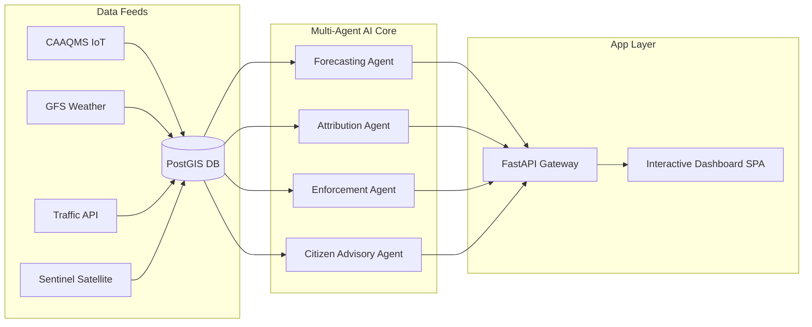

# AURA: Air Quality Urban Response Agent 🌬️🏙️

> **AI-Powered Urban Air Quality Intelligence for Proactive Smart City Intervention**

AURA is a high-fidelity, hackathon-ready, multi-agent AI platform designed to help municipal administrations move from reactive air quality monitoring to proactive pollution prevention. By fusing IoT sensor arrays, weather models, mobility congestion indexes, satellite observation feeds, and permitting registries, AURA enables targeted, ward-level smart city interventions.

---

## 🚀 Key Features

1. **Hyperlocal 72-Hour Forecasting:** A hybrid XGBoost-LSTM engine predicting ward-level AQI with 90% confidence bands.
2. **Pollution Source Attribution:** Real-time percentage breakdowns of local PM2.5 and PM10 contributors (Traffic, Construction, Industry, Waste Smoke, Background).
3. **Enforcement Intelligence:** Prioritized hotspot rankings, automated inspector routing, and evidence-backed citation package generation.
4. **Citizen Health Advisory System:** Role-based (astmatic, child, senior, worker) alerts translated into multiple regional Indian languages (Hindi, Kannada, Tamil) using LLM pipelines.
5. **Interactive Smart City GIS Dashboard:** A premium glassmorphic visual interface containing custom Leaflet mapping layers, Chart.js forecasting timelines, and live sliders.
6. **Smart "What-If" Policy Simulator:** Dynamic downwind Gaussian plume modeling to preview AQI reduction and carbon offsets ($CO_2$ kg) prior to deploying municipal mandates.
7. **AI Copilot Chatbot:** An administrator-facing natural language terminal to query trends and generate draft orders.

---

## 🛠️ Tech Stack

* **Frontend:** Single Page Application (SPA), HTML5, JavaScript (ES6+), Leaflet.js (GIS mapping), Chart.js (data viz), Lucide Icons, Vanilla CSS Grid & Flexbox (glassmorphism design).
* **Backend:** FastAPI (Python), Uvicorn server, Pydantic, Pandas, NumPy.
* **Database & GIS:** SQLite (zero-config local prototype) / PostgreSQL + PostGIS (production-ready).
* **LLM Engine:** Gemini API integrations.

---

## 📁 Repository Folder Structure

```
aura-aqi-platform/
│
├── backend/
│   ├── main.py              # FastAPI server, endpoints, and simulation engine
│   └── requirements.txt     # Python packages list
│
├── frontend/
│   ├── index.html           # Core single-page application dashboard layout
│   ├── app.js               # Leaflet maps, Chart.js, simulator logic, and Copilot client
│   └── style.css            # Custom CSS with modern dark glassmorphic styling
│
│
└── README.md                # This project index file
```

---

## ⚙️ System Architecture



---

## ⚡ Quick Start (Local Run)

Get AURA up and running in less than 3 minutes:

1. **Activate Environment & Install dependencies:**
   ```bash
   pip install -r backend/requirements.txt
   ```
2. **Start the server:**
   ```bash
   python -m uvicorn backend.main:app --reload
   ```
3. **Open the browser:**
   Go to [http://localhost:8000](http://localhost:8000).

---

