# Agent Workflow: Multi-Agent Collaboration Protocol

AURA is designed as a collaborative ecosystem of specialized AI agents. The workflow is event-driven: a change in ambient sensor data or forecast signals triggers a chain of agent tasks.

---

## 1. Sequence of Collaboration

The diagram below details the operational loop when a critical pollution threshold is exceeded:

```mermaid
sequenceDiagram
    autonumber
    participant Scheduler as System Cron/Scheduler
    participant DataAgent as Data Ingestion Agent
    participant DB as PostGIS database
    participant ForecastAgent as Forecasting Agent
    participant AttribAgent as Attribution Agent
    participant EnforceAgent as Enforcement Agent
    participant CitizenAgent as Citizen Advisory Agent
    participant LLM as Gemini API (Advisory & Copilot)

    Scheduler->>DataAgent: Trigger Ingest Pipeline (15 min interval)
    DataAgent->>DataAgent: Ingest IoT, Traffic, Weather & Satellite Feeds
    DataAgent->>DB: Save normalized geospatial tables
    DataAgent->>ForecastAgent: Dispatch Raw telemetry payload
    
    ForecastAgent->>DB: Fetch 14-day history & Weather arrays
    ForecastAgent->>ForecastAgent: Run XGBoost-LSTM Predictor
    ForecastAgent->>DB: Save 72h forecasts
    
    rect rgb(30, 41, 59)
        note right of ForecastAgent: If Ward Forecasted AQI > 150
        ForecastAgent->>AttribAgent: Request attribution context for Ward X
        AttribAgent->>DB: Pull local traffic indices, industrial stack statuses, satellite anomalies
        AttribAgent->>AttribAgent: Compute Source Attribution coefficients (%)
        AttribAgent->>EnforceAgent: Pass Attribution and Forecast data
    end

    EnforceAgent->>DB: Fetch active permits and inspector schedules
    EnforceAgent->>EnforceAgent: Priority-rank hotspot targets (Vulnerability * Forecast AQI)
    EnforceAgent->>DB: Create Enforcement Case (status: PENDING)
    EnforceAgent->>CitizenAgent: Request localized advisories for hotspots

    CitizenAgent->>LLM: Generate role-specific warnings (Children, Elderly, Asthmatics)
    LLM-->>CitizenAgent: Structured text alerts (translated in EN, HI, KN, TA)
    CitizenAgent->>DB: Save Health Advisories for API consumption
```

---

## 2. Agent Specifications

### 2.1. Ingestion Agent
* **Trigger:** Chronological schedule (15m, 3h, 24h).
* **Role:** Ingest, clean, perform geospatial tagging (`ST_Contains`).
* **Output:** Normalized database entries, broadcasts `DataUpdatedEvent`.

### 2.2. Forecasting Agent
* **Trigger:** Receives `DataUpdatedEvent`.
* **Role:** Sequence forecasting. Combines historical LSTM output with meteorological conditions (dispersion direction).
* **Output:** Predicts $t+24, t+48, t+72$ hours AQI with upper/lower bounds.

### 2.3. Source Attribution Agent
* **Trigger:** Forecasting Agent detects a ward exceeding AQI 150.
* **Role:** Spatial anomaly correlation.
* **Algorithm:** Solves a regression over spatial distance to emission points (industries, construction projects, high traffic junctions) weighted by wind direction.
* **Output:** Attribution percentages (Traffic: X%, Dust: Y%, Industry: Z%, Smoke: W%).

### 2.4. Enforcement Intelligence Agent
* **Trigger:** Receives source attribution coefficients.
* **Role:** Optimization router. Cross-checks violating locations with municipal registries (e.g. Is Peenya plant operating during a mandated halt?).
* **Output:** Generates prioritized patrol routes for inspection teams.

### 2.5. Citizen Advisory Agent
* **Trigger:** Hyperlocal AQI > 150.
* **Role:** Natural language generation and translation.
* **Input Payload:** `{ward: "Peenya", aqi: 210, dominant_pollutant: "PM10", language: "KN"}`
* **Output:** Contextual advice: *"ಪೀಣ್ಯದಲ್ಲಿ ವಾಯು ಮಾಲಿನ್ಯ ಹೆಚ್ಚಾಗಿದೆ. ದಯವಿಟ್ಟು ಮಾಸ್ಕ್ ಧರಿಸಿ..."* (Kannada).

### 2.6. Report Generation Agent
* **Trigger:** Manual request or nightly cron.
* **Role:** Compiles findings, maps, and recommended actions into a formatted dossier.
