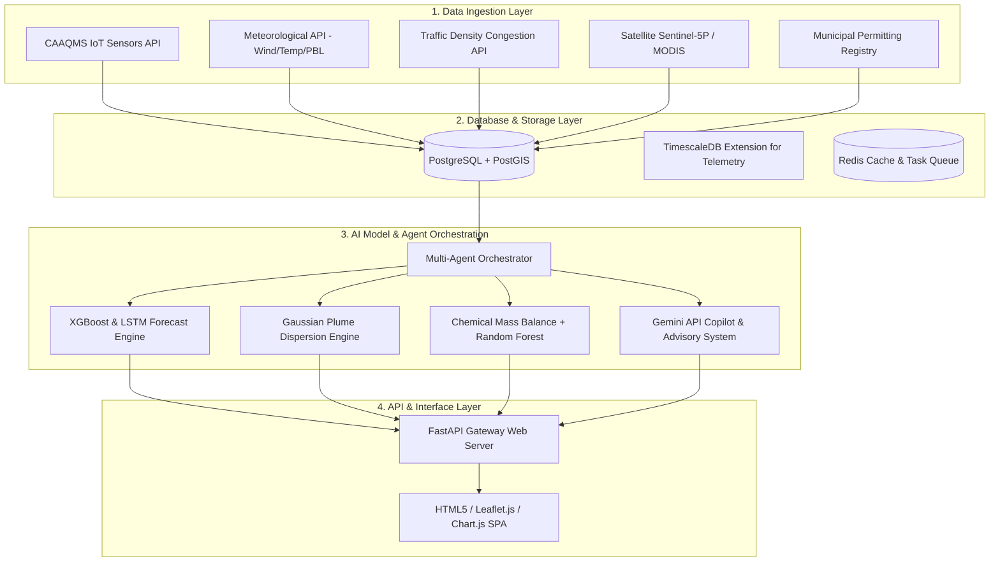

# System Architecture: AeroSense / AURA Platform

The AURA platform utilizes a multi-layered, service-oriented architecture designed to handle real-time spatial-temporal data ingestion, model serving, multi-agent orchestration, and responsive client-side rendering.

---

## 1. High-Level Architectural Flow

---

## 2. Component Explanations

### 2.1. Ingestion & ETL Pipelines
* **Task Scheduler:** Celery worker or FastAPI background scheduler firing:
  * Every 15 minutes: IoT sensor updates, traffic speeds.
  * Every 3 hours: High-resolution GFS meteorological predictions.
  * Every 24 hours: Active fire spots (thermal anomalies) and Sentinel-5P NO2 tropospheric column densities.
* **Spatial Normalization:** A Python ETL pipeline uses **GeoPandas** to map coordinates to specific municipal ward polygons.

### 2.2. Database & Spatial Indexing
* **PostgreSQL + PostGIS:** Wards are stored as `GEOMETRY(Polygon, 4326)`. Heavy spatial queries (e.g., *Find all industrial chimneys within 3km of an AQI hotspot*) use GIST indexing (`CREATE INDEX idx_wards_geom ON wards USING gist(geom);`).
* **SQLite + Python (Prototype):** The hackathon prototype implements a custom lightweight Python spatial matcher to evaluate coordinates against rectangular bounding boxes, ensuring zero-configuration local runs.

### 2.3. The Forecasting and Dispersion Models
1. **Temporal Forecasting (LSTM):** Processes the historical 14-day AQI trend per ward to learn diurnal and weekend/weekday profiles.
2. **Spatial Feature Engineering (XGBoost):** Combines the LSTM temporal vector with real-time weather features (wind direction vector, wind velocity, temperature inversion) and localized features (distance to industrial zones, traffic index).
3. **Gaussian Plume Dispersion Model:** Used by the *What-If Simulator* to compute downwind impacts. The formula for ground-level concentration $C(x, y, z=0)$ is modeled as:
   \[
   C(x,y) = \frac{Q}{2\pi u \sigma_y \sigma_z} \exp\left( \frac{-y^2}{2\sigma_y^2} \right) \left[ \exp\left( \frac{-(z-H)^2}{2\sigma_z^2} \right) + \exp\left( \frac{-(z+H)^2}{2\sigma_z^2} \right) \right]
   \]
   Where:
   * $Q$ = source emission rate (modified by policy sliders)
   * $u$ = wind speed
   * $\sigma_y, \sigma_z$ = dispersion coefficients (determined by atmospheric stability class)
   * $H$ = effective stack height

### 2.4. LLM & Citizen Advisory Pipeline
* **Context Assembly:** When the Citizen Advisory Agent triggers, it pulls the current AQI and forecast, and sends it to the Gemini API with structured prompts requesting custom safety advice for:
  * Asthmatics
  * Elderly
  * Children
  * Outdoor manual laborers
* **Multi-Lingual Translation:** The prompt instructs the model to translate into specific target languages (Hindi, Kannada, Tamil, etc.) and returns structured JSON responses.

### 2.5. Frontend Delivery
* Served as static HTML, CSS, and JS directly from the FastAPI backend.
* Uses **Leaflet.js** for mapping, drawing choropleths over the wards, displaying markers, and placing heatmaps.
* Uses **Chart.js** for generating smooth, responsive timeline charts and source-attribution pie charts.
